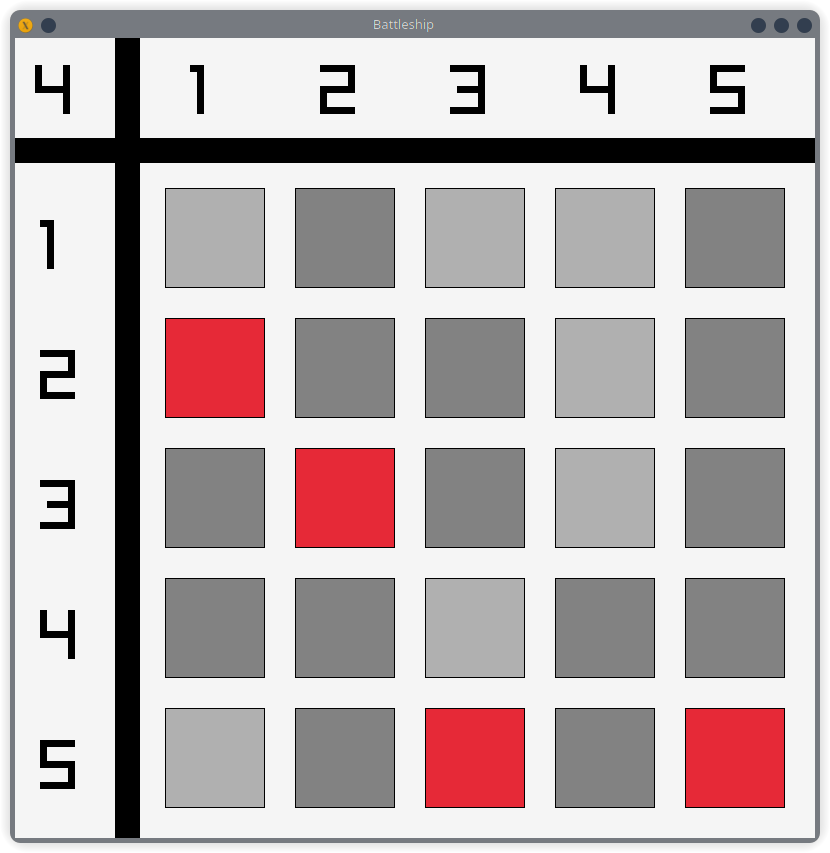

# Battleships Game

A modern implementation of the classic Battleships game using C++ and Raylib for graphics rendering.

 <!-- You'll need to add this -->

## Description

This is a single-player version of Battleships where players have 15 rounds to find 5 hidden battleships on a 5x5 grid. The game features a clean, minimalist interface with intuitive mouse controls.
Probably one of the worst coded games you will ever see, but it works.
This is my final project for my C++ class this semester, so I decided to have some fun with it.

## Game Features

- 5x5 grid gameplay
- 5 battleships to find
- 15 rounds to win
- Simple click interface
- Visual feedback for hits and misses
- Win/Lose condition displays

## Prerequisites

- CMake (3.0 or higher)
- C++ Compiler with C++11 support
- Git

## Dependencies

- Raylib (automatically fetched by CMake)

## Building the Game

1. Clone the repository:

```bash
git clone https://github.com/yourusername/Battleships.git
cd Battleships
```

2. Generate build files and compile:

```bash
cmake -B build
```

3. Enter Build Directory and run make

```bash
make
```

4. Run the game:

```bash
./Battleships # On Linux
./Battleships.exe # On Windows
./Battleships.app # On MacOS
```

  <summary>Version specific instructions</summary>

  ### Building on Different Platforms:
  1.**Linux:**

  # Install dependencies
  ```bash
  sudo apt-get update
  sudo apt-get install build-essential git cmake libx11-dev libxrandr-dev libxinerama-dev libxcursor-dev libxi-dev
  ```
  # Build
  ```bash
  mkdir build && cd build
  cmake ..
  make
  ```

  2. **macOS:**
  ```bash

  # Install dependencies (using Homebrew)
  brew install cmake

  # Build
  mkdir build && cd build
  cmake ..
  make
  ```

  3. **Windows:**
  ```bash
  # Using MinGW
  mkdir build && cd build
  cmake -G "MinGW Makefiles" ..
  cmake --build .

  # Or using Visual Studio
  mkdir build && cd build
  cmake -G "Visual Studio 17 2022" -A x64 ..
  cmake --build . --config Release
  ```

  ### Platform-Specific Notes:

  1. **Linux Users:**
  - Need X11 development packages
  - OpenGL development packages
  - Basic build tools (gcc/g++, make)

  2. **macOS Users:**
  - Need Xcode Command Line Tools
  - OpenGL is included in the system
  - Might need to install cmake via Homebrew

  3. **Windows Users:**
  - Choice between MSVC (Visual Studio) and MinGW
  - Need to ensure proper PATH setup
  - May need to install additional Windows SDKs

  The key differences in the cross-platform build are:
  - Different system libraries required per platform
  - Different linking requirements
  - Platform-specific compiler flags and definitions
  - Different ways of handling paths and file system operations


## How to Play

1. Launch the game
2. Click on grid tiles to search for battleships
3. Red tiles indicate hits
4. Gray tiles indicate misses
5. Find all 5 battleships within 15 moves to win

## Game Controls

- Left Mouse Button: Select and reveal tiles
- ESC: Exit game

## Game Rules

- You have 15 rounds to find 5 battleships
- Each battleship occupies one tile
- Game ends when either:
  - All 5 battleships are found (Victory)
  - 15 rounds are used without finding all battleships (Defeat)

## Project Structure

```
Battleships/
├── headers/           # Header files
├── sources/           # Source files
├── assets/           # Game assets
└── CMakeLists.txt    # Build configuration
```

## Technical Information

- Written in C++11
- Uses Raylib for graphics rendering
- Grid-based collision detection
- State-based game management

## Screenshots

 <!-- You'll need to add this -->
 <!-- You'll need to add this -->


## Contributing

Contributions are welcome! Please feel free to submit a pull request.

## License

This project is licensed under the zlib/libpng license, the same license as Raylib. For more details, see the [LICENSE](LICENSE) file in the project repository.
